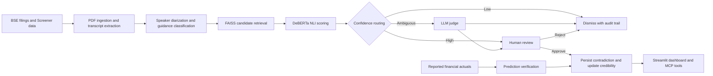

# ContraGuard — Financial Guidance Contradiction Tracker

ContraGuard is an AI-powered financial intelligence platform that analyzes Indian corporate earnings-call transcripts, detects contradictions in management guidance, verifies predictions against reported results, and scores executive credibility.

## Problem Statement

Investors and analysts rely on guidance from CEOs, CFOs, and other senior executives when evaluating a company. These statements are spread across quarterly transcripts and filings, making it difficult to determine whether management:

- reverses an earlier commitment or forecast;
- changes its tone or strategic priorities over time;
- stops discussing a previously important topic;
- delivers the financial outcome it predicted; or
- has a consistent and credible communication history.

Keyword search alone cannot reliably identify these issues because contradictions are often semantic rather than literal. Automated model decisions can also produce false positives, so high-impact findings need traceable evidence and human validation before they affect an executive's credibility score.

## Proposed Solution

ContraGuard builds a longitudinal record of management guidance from BSE earnings-call documents and financial data from Screener.in. It extracts executive statements, compares related claims across quarters, and classifies inconsistencies as:

- **Hard contradictions:** Direct conflicts between two statements.
- **Soft contradictions:** Changes in sentiment, confidence, hedging, or strategic direction.
- **Omissions:** Topics emphasized in prior quarters but absent from the latest discussion.
- **Prediction misses:** Quantitative guidance that does not match the subsequently reported result.

A stateful LangGraph workflow combines DeBERTa-based natural language inference with an LLM judge. Clear cases are routed automatically, ambiguous cases receive additional evaluation, and potential hard contradictions pause for human approval or rejection. Only approved findings affect the executive's credibility score.

The platform presents the resulting evidence, trends, predictions, and review tasks through a Streamlit dashboard. It also exposes nine typed MCP tools so compatible AI clients can query and operate the system through a standard interface.

## Implementation

### Processing Workflow



### Core Components

1. **Data ingestion:** Downloads earnings-call PDFs and company data, extracts transcript text with PyMuPDF, and stores normalized records in SQLite.
2. **Guidance extraction:** Uses spaCy, FinBERT models, and rule-based classifiers to identify speakers, guidance statements, topics, sentiment, confidence, and quantitative predictions.
3. **Semantic retrieval:** Creates sentence embeddings and uses FAISS to find comparable statements from the same executive across reporting periods.
4. **Contradiction detection:** Applies a DeBERTa NLI cross-encoder for hard contradictions and dedicated detectors for soft contradictions and omissions.
5. **Stateful adjudication:** Uses LangGraph to route NLI results, call a provider-neutral LLM judge for uncertain pairs, interrupt for human review, and resume from persistent SQLite checkpoints.
6. **Credibility scoring:** Calculates a 0–100 executive credibility score using approved contradictions and verified prediction outcomes.
7. **Human review:** Displays statement pairs, model probabilities, LLM evidence, reviewer notes, and decision history in the Streamlit review queue.
8. **MCP integration:** Provides bounded, parameterized tools for statements, contradictions, semantic search, credibility, reviews, and prediction verification over stdio.

### Data Scope

The default configuration covers Reliance Industries, Infosys, HDFC Bank, Tata Consultancy Services, and Wipro across eight reporting periods from Q1 FY23 through Q4 FY24. Companies and quarters can be changed centrally in `config.py`.

### Contradiction Routing

- NLI contradiction probability **≥ 0.80:** route directly to human review.
- Probability **≤ 0.20** with a non-contradiction verdict: dismiss and retain an audit record.
- Scores between the thresholds: send to the LLM judge, then route the result to review or dismissal.
- Model errors, unsupported providers, and uncertain verdicts: fail safely to human review.

LangGraph checkpoints are stored in `data/langgraph_checkpoints.db`, allowing interrupted review workflows to survive process restarts. Application data is stored in `data/tracker.db`.

### MCP Tools

| Tool | Purpose |
|---|---|
| `query_statements` | Filter extracted guidance by company, executive, quarter, type, or sentiment. |
| `get_contradictions` | Retrieve contradictions by company, executive, type, score, review status, or quarter. |
| `get_credibility_score` | Return executive credibility scores and risk details. |
| `find_similar_statements` | Search an executive's statements using FAISS semantic retrieval. |
| `list_pending_reviews` | List hard-contradiction candidates awaiting a human decision. |
| `get_prediction_status` | Retrieve quantitative predictions and their verification status. |
| `approve_contradiction` | Approve a reviewed contradiction and apply its credibility penalty. |
| `reject_contradiction` | Reject a candidate without changing the credibility score. |
| `verify_prediction_actual` | Record an actual value and recompute the relevant credibility score. |

### Setup and Execution

```powershell
# Create and activate a virtual environment, then install dependencies
python -m venv venv
.\venv\Scripts\Activate.ps1
pip install -r requirements.txt
python -m spacy download en_core_web_sm

# Initialize the database
python run_ingestion.py --init-only

# Ingest documents and extract guidance
python run_ingestion.py
python run_extraction.py

# Build embeddings and run contradiction detection
python run_contradiction.py --backfill
python run_contradiction.py --run-pipeline

# Extract predictions and calculate credibility scores
python run_credibility.py --extract-predictions
python run_credibility.py --score

# Launch the dashboard
streamlit run dashboard/app.py
```

Run the MCP server with:

```powershell
python -m mcp_server.server
```

Run the test suite with:

```powershell
.\venv\Scripts\pytest.exe tests -v
```

For offline development and testing, use the deterministic mock judge:

```env
LLM_PROVIDER=mock
MOCK_LLM=true
```

For live LLM adjudication, set `LLM_PROVIDER` to `openai` or `anthropic` and provide the corresponding API key.

## Tech Stack

| Layer | Technologies |
|---|---|
| Language | Python |
| Data ingestion | Requests, Beautiful Soup, lxml, PyMuPDF |
| NLP and ML | DeBERTa, FinBERT, sentence-transformers, spaCy, PyTorch |
| Semantic search | FAISS |
| Workflow orchestration | LangGraph, Pydantic |
| LLM adjudication | OpenAI or Anthropic, with deterministic mock and safe fallback modes |
| Storage | SQLite, LangGraph SQLite checkpointer, DuckDB |
| Dashboard | Streamlit, Plotly, pandas |
| AI interoperability | Model Context Protocol Python SDK, stdio transport |
| Testing | pytest |

## Use Case

**Live demo:** [contraguard.streamlit.app](https://contraguard.streamlit.app/)

An analyst reviewing a company's quarterly performance can use ContraGuard to:

1. Search historical guidance from a specific executive or company.
2. Compare related statements across quarters using semantic search.
3. Inspect detected hard, soft, and omission contradictions with supporting evidence.
4. Review ambiguous hard-contradiction candidates before any penalty is applied.
5. Compare numerical forecasts with reported financial actuals.
6. Track executive credibility scores and communication patterns over time.

ContraGuard is useful for equity research, due diligence, corporate governance, risk monitoring, and any workflow that requires evidence-backed evaluation of management consistency.
